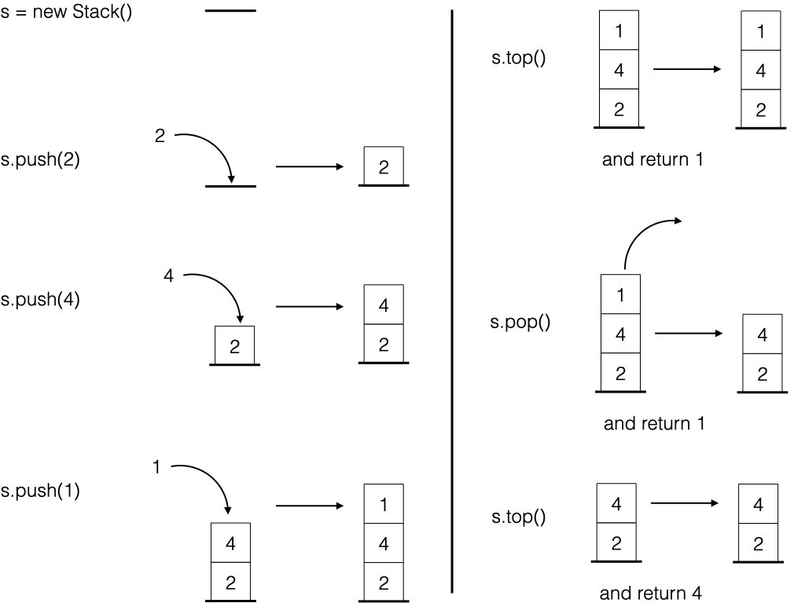

# PS4: Stacks
* Wrap-up on OOP concepts
* Standard algorithmic structures: stacks and their implementations
* JUnit testing

## WARNING
This is the version for students working with Eclipse on school's virtual machines. If you want to work online on [repl.it](https://www.repl.it) platform, take a look at [corresponding guidelines](guidelines_for_online_practical_session.md).


## Starting point

* Start by grabing the code from the repository [https://github.com/gaudel/java_PS4](https://github.com/gaudel/java_PS4/archive/master.zip)
* Eclipse can import the project using `File => Import => General => Projets from Folder or Archive` feature
* To enable JUnit, right-click on the project and choose `Build Path => Add Libraries... => JUnit => JUnit 4 => Finish`
* Take some time to make sure you understand the code and what it is doing	
	* `Main.java` in `src/main/java/stack` runs an example of use of a stack for each implementation of the interface `Stack` (already done, to run)
	* `Stack.java` in `src/main/java/stack` defines the `Stack` interface (already done)
	* `ArrayStack.java` in `src/main/java/stack` defines the `ArrayStack` class, implementing the `Stack` interface (to complete)
	* 	`LinkedListStack.java` in `src/main/java/stack` defines the `LinkedListStack` class, implementing the `Stack` interface (to complete)
	*  `src/test/java/stack` contains a test file per concrete class (for each file, complete `newStackShouldBeEmpty()` and run the tests)


## 1. Stack interface
A stack is an object which stores a collection of other objects (integers for current practical session) for which you can only *add* or *remove* one object. It follows the *Last In First Out* principal: when you ask for an object in the collection you get the last one added to the collection. A stack offers the methods:

* `boolean isEmpty()`: returns `true` if the stack is empty, and `false` otherwise;
* `void push(int value)`: add `value` on top of the stack;
* `int top()`: return the value on top of the stack (do not remove it),
	* if the Stack is empty, throws an `IsEmptyException` exception;
* `int pop()`: remove the value on top of the stack (and return it),
	* if the Stack is empty, throws an `IsEmptyException` exception;
* `int size()`: return the size of the stack.

<p style="text-align: center;">

</p>

## 2. ArrayStack

Implement and test `ArrayStack`:

* complete the implementation,
* run the JUnit tests,
* run the example in `Main.java`.

An object of type `ArrayStack` is composed of two attributes:

* `int size`: the number of values in the stack
* `int[] data`: an array of length greater or equal to `size`, such that
	* `data[0]` is the first stacked value,
	* `data[1]` is the second stacked value,
	* up to `data[size-1]` which is the last stacked value.

Note that values from  `data[size-1]` to `data[data.length-1]` are meaningless.

By example, the following `ArrayStack` corresponds to the stack with values 2, 0, and 1 (from the oldest to the youngest):


$\begin{array}{|rl|}
\hline
& ArrayStack\\
\hline
size:& 3\\
next:& [2, 0, 1, 0, 0, 0]\\
\hline
\end{array}$


The file `stack.pdf` shows the evolution of these attributes when applying stack methods. Note that when adding a `size+1`-th value to a stack with `data.length` equal to `size`, a new array of length `2*size` has to be constructed and filled with already stacked values.


## 2. LinkedListStack

Implement and test `LinkedListStack`:

* complete the implementation,
* run the JUnit tests,
* run the example in `Main.java`.

An object of type `LinkedListStack` is composed of two attributes:

* `int size`: the number of values in the stack,
* `Node next`: a node which contains
	* `int value`: the value on the top of the stack,
	* `Node next`: a node which contains
		* `int value`: the value on the second-top of the stack,
		* `Node next`: a node which contains
			* ...
				* `int value`: the value at the bottom of the stack,
				* `Node next`: `null`, to identify the bottom of the stack.

Note that the class `Node` has to be defined somewhere. For the practical session, its definition is in the file `LinkedListStack.java`.

With such implementation, an empty stack corresponds to the object

$\begin{array}{|rl|}
\hline
& LinkedListStack\\
\hline
size:& 0\\
next:& null\\
\hline
\end{array}$

and the stack with values 2, 0, and 1 (from the oldest to the youngest) would be represented by the set of objects


$\begin{array}{|rl|}
\hline
& LinkedListStack\\
\hline
size:& 3\\
next:& \begin{array}{|rl|}
		\hline
		&Node\\
		\hline
		value:& 0\\
		next:& \begin{array}{|rl|}
				\hline
				&Node\\
				\hline
				value:& 1\\
				next:& \begin{array}{|rl|}
						\hline
						&Node\\
						\hline
						value:& 2\\
						next:& null\\
						\hline
						\end{array}\\
				\hline
				\end{array}\\
		\hline
		\end{array}\\
\hline
\end{array}$


The file `stack.pdf` shows the evolution of this attributes when applying stack methods.


## (Bonus) LinkedListStackIterator
The aim is to be able to manipulate an iterator on a `LinkedListStack` which would iterate from the top to the bottom of the stack without changing the stack. Typically, this code

```java
LinkedListStack s = new LinkedListStack();
s.push(1);
s.push(2);
s.push(3);
s.pop();
LinkedListStack.LinkedListStackIterator it = s.iterator();
while (it.hasNext()) {
	System.out.println(it.next());
}
System.out.println(s);
```

would output

```
2
1
[1, 2] 
```

I have to had to the `LinkedListStack` class

* the method `public LinkedListStackIterator iterator()`,
* and the class `LinkedListStackIterator`,
where the Application Programming Interface of `LinkedListStackIterator` is

```
public LinkedListStackIterator(LinkedListStack s);
public int next() throws NoNextException;
public boolean hasNext();
```

By the way, the methods `next()` may return an exception which class has to be defined.

Finally, do not forget to populate `LinkedListStackTest.java` with tests related to this new functionality.